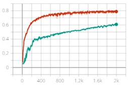
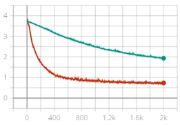
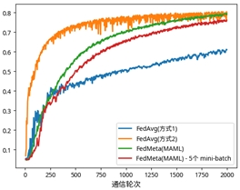
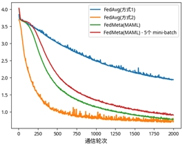

# Federated Meta-Learning with Fast Convergence and Efficient Communication
This repo contains unofficial pytorch implement of paper [Federated Meta-Learning with Fast Convergence and Efficient Communication](https://arxiv.org/abs/1802.07876)
Due to lack of official codes, I am confused with such statements placed in the paper:

Page 6:
> We filter inactive clients with fewer than k records, which is set to be 10, 20, 25 for
FEMNIST, Shakespeare, and Sent140 respectively

It might ask me to drop the disqualified clients 


Page 12:
> Evaluation There are two common ways to define testing accuracy in the federated setting, namely
accuracy with respect to all data points and ...

I evaluate the performance across all the test clients.

Page 12:
> We use Adam [7] as the local optimizer for all approaches

It seems that it impossible to use Adam as optimizer of inner loop of meta-learning and I use gradient descend instead.

# Generation of dataset
I included submodule LEFA for simplification, for more details, you can visit [LEAF: A Benchmark for Federated Settings](https://github.com/TalwalkarLab/leaf).

To split a client's data, you can go to `dataset/<dataset_name>` folder and run `python split_support_query.py <p>` to take it apart. `p` specify the fraction of support set.

# Experiments

Both FedAvg and FedMeta support two schemes for Algorithm 1:

1. Sampling mini-batch(s) from support set and query set from both meta-train and meta-test clients when training or testing. It is same as what we do in meta-learning.

2. Use full data of support and query set.

You can use `train_inner_step` and `test_inner_step` option to specify the number of mini-batch(s)(default is `0` which means use full dataset).


### For FEMNIST

FedMeta:
```bash
python run.py --algo=fedmeta \
--eval_on_test_every=1 \
--dataset=femnist_p_0.2 \
--lr=0.001 \
--num_epochs=1 \
--model=cnn \
--clients_per_round=4 \
--batch_size=10 \
--data_format=pkl \
--num_rounds=2000 \
--meta_algo=maml \
--outer_lr=0.0001 \
--result_prefix=./fedmeta_result \
--device=cuda:0 \
--save_every=1000 \
--meta_inner_step=5 \
``` 

FedAvg:

```bash
--algo=fedavg_adv \
--eval_on_test_every=1 \
--dataset=femnist_p_0.2 \
--lr=1e-4 \
--num_epochs=1 \
--model=cnn \
--clients_per_round=4 \
--batch_size=10 \
--data_format=pkl \
--num_rounds=2000 \
--result_prefix=./fedmeta_result \
--device=cuda:6 \
--save_every=1000 \
```
Note that it different from FedAvg because of clients are divided into meta-train and meta-test tasks.

I ran the FedAvg based on difference schemes(Red one is scheme 2, green one is scheme 1):

Accuracy|Loss
|-|-
|

Contrast to FedAvg, FedMeta use train dataset as support set and test dataset as query set. The red one uses 5 mini-batches during inner loop and outer loop.
Accuracy|Loss
|-|-
|

**Note** I can't achieve the same performance!!! I hope the author can share their implementation :)

# TO-DO

1. LSTM model(Current version cost too many GPU resource)
2. I also implements the [tensorflow version](https://github.com/ddayzzz/federated-learning/tree/master/flearn) but the performance need to verify. 